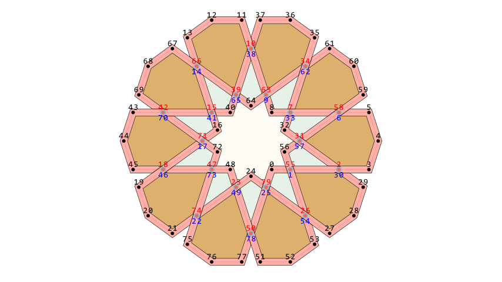
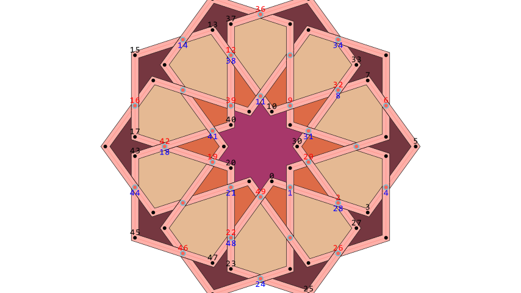
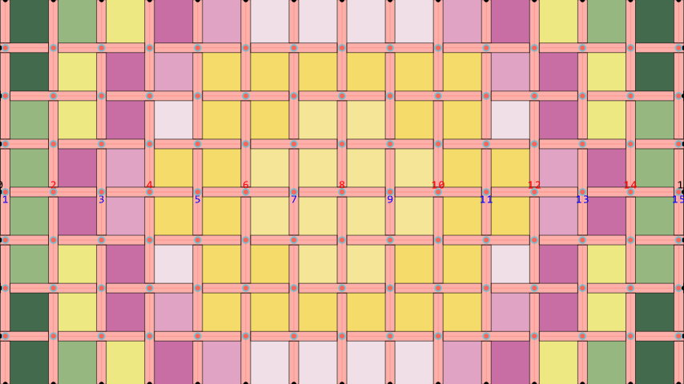
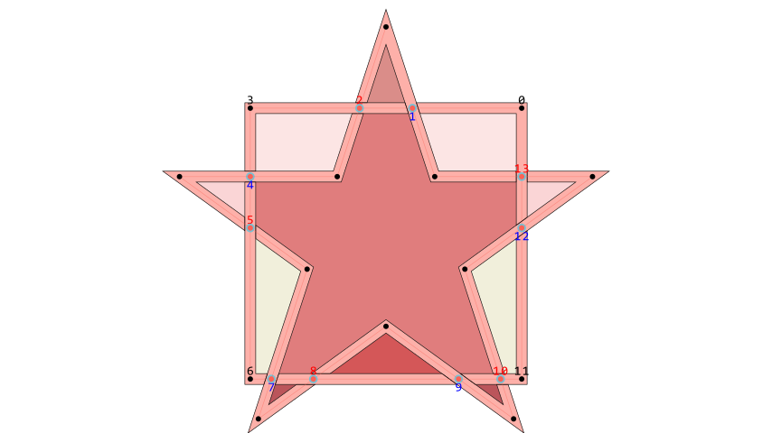

# Interlacing Algorithm for Manim

[](https://github.com/ManimCommunity/manim) 

Lace (Interlacing) 算法用于将任意 [Manim](https://github.com/ManimCommunity/manim) 路径转换为具有"编织交错"效果的丝带图案。当多条路径相交时，算法会自动计算交替的上下遮挡关系，模拟真实编织物的视觉效果。

<p align="center">
  
  
  
  
</p>

## 算法流程详解

Lace 算法的核心思想是将几何问题转化为拓扑图论问题。通过构建路径的偏移线（Offset Lines）并计算交点，将丝带分割为多个片段。通过在交点处交替“绘制”与“跳过”的操作，无需复杂的深度缓冲（Z-buffer）即可模拟出逼真的编织遮挡效果。

### 1. 预处理 (Preprocessing)

输入为任意的 Manim `VMobject`。

1.  **路径提取 (`extract_paths`)**:
    *   遍历输入对象的所有子路径。
    *   **清洗与合并**: 移除重复点、共线点，并将连接的路径合并为更长的链或闭环 (`merge_paths`)。
    *   **标准化**: 确保所有闭合路径的方向一致（如右手定则），便于统一处理。

### 2. 偏移线生成 (Offset Generation)

为了模拟有宽度的丝带，算法为主路径生成两条平行的“偏移线”。

*   **算法**: 使用 **Miter Join** (斜接) 算法。
*   **计算**: 基于路径切向计算法向量，结合 Miter Limit 处理锐角过长的问题。
*   **输出**: 为每条路径生成左 (`paths_l`) 右 (`paths_r`) 两条偏移路径。

### 3. 交点计算 (Intersection Calculation)

算法构建了一个基于 **Segment (线段)** 和 **Intersection (交点)** 的网络。

1.  **扫描线算法**: 使用高效的扫描线算法 (`_cal_intersections`) 计算所有偏移线段之间的交点。
2.  **交点聚类**: 记录每个线段上的所有交点，并按距离起点的远近进行排序。
3.  **图构建**: 利用交点作为节点，构建描述丝带连通性的拓扑图。

### 4. 区域识别与生成 (Region Generation)

算法根据拓扑信息生成两种主要的可视化元素：**孔洞 (Holes)** 和 **丝带 (Ribbons)**。

#### 孔洞生成 (`_set_holes`)
*   **闭环搜索**: 在交点构成的图中寻找闭合路径（Cycles）。
*   **筛选**: 排除掉极小面积的无效环，剩余的闭环即为丝带围成的“孔洞”。
*   **开放路径处理**: 对于非闭合路径，使用 `KDTree` 寻找最近的邻居端点，构建虚拟连接以封闭孔洞区域，确保填充颜色的正确性。

#### 丝带生成 (`_set_ribbons`)
*   **交错逻辑**: 这是实现编织效果的关键。
    *   算法遍历每条路径，沿着偏移线行进。
    *   维护一个布尔标志 `flag`，在经过每个交点时翻转 (`not flag`)。
    *   **绘制**: 当 `flag` 为真时，连接当前的偏移线段，形成一个闭合的多边形（丝带片段）。
    *   **跳过**: 当 `flag` 为假时，跳过当前线段，不生成几何图形。
*   **视觉效果**: 通过这种交替的“通”与“断”，在二维平面上完美模拟了“上/下”穿插的视觉错觉。被“跳过”的部分会露出下方的背景或另一条丝带（如果该处恰好是对方的“绘制”段），从而形成遮挡关系。

## 关键数据结构

*   **`Interlacing`**: 核心计算类，负责路径处理、交点计算和拓扑分析。
*   **`d_intersections`**: 字典，存储交点坐标。键为涉及的线段ID集合。
*   **`d_seg_intersects`**: 字典，映射每个线段到其上的有序交点列表。
*   **`Lace`**: Manim `VGroup` 的子类，负责调用 `Interlacing` 并将生成的几何数据 (`Polygon`) 转换为 Manim 可渲染对象。

## 使用方法

Lace 类是本库的核心接口，继承自 `manim.VGroup`。

```python
from manim_lace import Lace
from manim import *

class MyScene(Scene):
    def construct(self):
        # 1. 准备路径 (VMobject)
        my_path = Star(n=5, outer_radius=3, inner_radius=1.5)
        
        # 2. 创建 Lace 对象
        lace = Lace(
            target_mobject=my_path, 
            offset=0.2,
            hole_opacity=0.8,
            hole_color=None,        # 使用自动分组着色
            hole_group_method="by_area",
            stroke_color=WHITE,     # 丝带边框颜色
            fill_color=BLUE,        # 丝带填充颜色
            fill_opacity=1.0
        )
        
        self.add(lace)
```

### 参数详解

#### `target_mobject` (`manim.VMobject`)
必填。需要进行编织效果处理的 Manim 向量对象。可以是简单的形状（如 `Circle`, `Square`），也可以是复杂的路径（如 `StarRosette`, `FunctionGraph`）。算法会自动提取其所有子路径进行计算。

#### `offset` (`float`)
默认值: `0.1`。
控制丝带的半宽。丝带的总宽度约为 `2 * offset`。
*   值越大，丝带越宽，孔洞越小。
*   值过大可能导致丝带重叠错乱或孔洞消失。

#### `hole_opacity` (`float`)
默认值: `1.0`。
孔洞填充颜色的不透明度 (0.0 ~ 1.0)。

#### `hole_color` (`Color` or `None`)
默认值: `None`。
*   如果指定了颜色（如 `RED`），则所有孔洞都将填充为该颜色，忽略分组逻辑。
*   如果为 `None`，则根据 `hole_swatch` 和 `hole_group_method` 自动计算颜色。

#### `hole_swatch` (`list[Color]` or `None`)
默认值: `None`。
*   用于自动着色的调色板（颜色列表）。
*   如果为 `None`，将使用内置的随机调色板。

#### `hole_group_method` (`str`)
默认值: `"by_area"`。
决定孔洞如何分组以进行着色。不同的分组会分配调色板中的不同颜色。
*   `"by_area"`: 按孔洞的面积和顶点数量分组。适合大多数几何图形，能区分大小不同的孔。
*   `"by_distance"`: 按孔洞中心到整体图形中心的距离分组。适合径向对称图形（如曼陀罗），产生中心向外辐射的色彩渐变。
*   `"by_hole_index"`: 每个孔洞自成一组（或按拓扑生成顺序）。颜色会显得比较随机。
*   `"by_vertex_count"`: 仅按孔洞的边数分组。

#### `**kwargs`
其他传递给丝带 (`RibbonFragment`) 的 `Polygon` 构造参数。
常用参数：
*   `stroke_color`: 丝带边缘线条颜色。
*   `stroke_width`: 丝带边缘线条粗细。
*   `fill_color`: 丝带内部填充颜色。
*   `fill_opacity`: 丝带填充不透明度。
